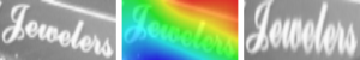

# MORAN: A Multi-Object Rectified Attention Network for Scene Text Recognition


| <center>Python 2.7</center> | <center>Python 3.6</center> |
| :---: | :---: |
| <center>[](https://travis-ci.org/Canjie-Luo/MORAN_v2)</center> | <center>[](https://travis-ci.org/Canjie-Luo/MORAN_v2)</center> |

MORAN is a network with rectification mechanism for general scene text recognition. The paper (accepted to appear in Pattern Recognition, 2019) in [arXiv](https://arxiv.org/abs/1901.03003), [final](https://www.sciencedirect.com/science/article/pii/S0031320319300263) version is available now.

[Here is a brief introduction in Chinese.](https://mp.weixin.qq.com/s/XbT_t_9C__KdyCCw8CGDVA)


## Recent Update

- 2019.03.21 Fix a bug about Fractional Pickup.
- Support [Python 3](https://www.python.org/).

## Improvements of MORAN v2:

- More stable rectification network for one-stage training
- Replace VGG backbone by ResNet
- Use bidirectional decoder (a trick borrowed from [ASTER](https://github.com/bgshih/aster))

| <center>Version</center> | <center>IIIT5K</center> | <center>SVT</center> | <center>IC03</center> | <center>IC13</center> | <center>SVT-P</center> | <center>CUTE80</center> | <center>IC15 (1811)</center> | <center>IC15 (2077)</center> |
| :---: | :---: | :---: | :---:| :---:| :---:| :---:| :---:| :---:|
| MORAN v1 (curriculum training)\* | <center>91.2</center> | <center>**88.3**</center> | <center>**95.0**</center> | <center>92.4</center> | <center>76.1</center> | <center>77.4</center> | <center>74.7</center> | <center>68.8</center> |
| <center>MORAN v2 (one-stage training)</center> | <center>**93.4**</center> | <center>**88.3**</center> | <center>94.2</center> | <center>**93.2**</center> | <center>**79.7**</center> | <center>**81.9**</center> | <center>**77.8**</center> | <center>**73.9**</center> |

\*The results of v1 were reported in our paper. If this project is helpful for your research, please [cite](https://github.com/Canjie-Luo/MORAN_v2/blob/master/README.md#citation) our Pattern Recognition paper.

## Requirements

(Welcome to develop MORAN together.)

We recommend you to use [Anaconda](https://www.anaconda.com/) to manage your libraries.

- [Python 2.7 or Python 3.6](https://www.python.org/) (Python 3 is faster than Python 2)
- [PyTorch](https://pytorch.org/) 0.3.* (`Higher version causes slow training, please ref to` [issue#8](https://github.com/Canjie-Luo/MORAN_v2/issues/8#issuecomment-455416756))
- [TorchVision](https://pypi.org/project/torchvision/)
- [OpenCV](https://opencv.org/)
- [PIL (Pillow)](https://pillow.readthedocs.io/en/stable/#)
- [Colour](https://pypi.org/project/colour/)
- [LMDB](https://pypi.org/project/lmdb/)
- [matplotlib](https://pypi.org/project/matplotlib/)

Or use [pip](https://pypi.org/project/pip/) to install the libraries. (Maybe the torch is different from the anaconda version. Please check carefully and fix the warnings in training stage if necessary.)

```bash
    pip install -r requirements.txt
```

## Data Preparation
Please convert your own dataset to **LMDB** format by using the [tool](https://github.com/bgshih/crnn/blob/master/tool/create_dataset.py) (run in **Python 2.7**) provided by [@Baoguang Shi](https://github.com/bgshih). 

You can also download the training ([NIPS 2014](http://www.robots.ox.ac.uk/~vgg/data/text/), [CVPR 2016](http://www.robots.ox.ac.uk/~vgg/data/scenetext/)) and testing datasets prepared by us. 

- [BaiduCloud (about 20G training datasets and testing datasets in **LMDB** format)](https://pan.baidu.com/s/1TqZfvoEhyv57yf4YBjSzFg), password: l8em
- [Google Drive (testing datasets in **LMDB** format)](https://drive.google.com/open?id=1NAs78a38xkl1MhodoD7BM0Lh3v_sFwYs)
- [OneDrive (testing datasets in **LMDB** format)](https://1drv.ms/f/s!Am3wqyDHs7r0hkHUYy0edaC2UC3c)

The raw pictures of testing datasets can be found [here](https://github.com/chengzhanzhan/STR).

## Training and Testing

Modify the path to dataset folder in `train_MORAN.sh`:

```bash
	--train_nips path_to_dataset \
	--train_cvpr path_to_dataset \
	--valroot path_to_dataset \
```

And start training: (manually decrease the learning rate for your task)

```bash
	sh train_MORAN.sh
```
- The training process should take **less than 20s** for 100 iterations on a 1080Ti.

## Demo

Download the model parameter file `demo.pth`.

- [BaiduCloud](https://pan.baidu.com/s/1TqZfvoEhyv57yf4YBjSzFg) (password: l8em)
- [Google Drive](https://drive.google.com/file/d/1IDvT51MXKSseDq3X57uPjOzeSYI09zip/view?usp=sharing)
- [OneDrive](https://1drv.ms/u/s!Am3wqyDHs7r0hkAl0AtRIODcqOV3)

Put it into root folder. Then, execute the `demo.py` for more visualizations.

```bash
	python demo.py
``` 



## Citation

```
@article{cluo2019moran,
  author    = {Canjie Luo and Lianwen Jin and Zenghui Sun},
  title     = {MORAN: A Multi-Object Rectified Attention Network for Scene Text Recognition},
  journal   = {Pattern Recognition}, 
  volume    = {90}, 
  pages     = {109--118},
  year      = {2019},
  publisher = {Elsevier}
}
```

## Acknowledgment
The repo is developed based on [@Jieru Mei's](https://github.com/meijieru) [crnn.pytorch](https://github.com/meijieru/crnn.pytorch) and [@marvis'](https://github.com/marvis) [ocr_attention](https://github.com/marvis/ocr_attention). Thanks for your contribution.

## Attention
The project is only free for academic research purposes.
